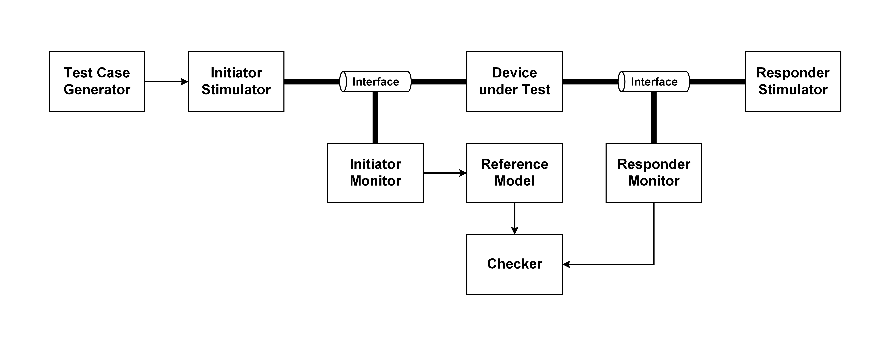

# Verification Architecture

## Device under Test

Device under test (DUT) is the design to be verified.

## Test Case Generator

Test case generator generates test cases.
Test cases is generated and encapsulated with the test case data class.
After test case generation, the generator send test cases to initiator stimulator via mailbox.

## Initiator Stimulator

Initiator stimulator starts tests.
Initiator stimulator receives test cases from the generator and generates corresponding signals to drive the DUT.
Interface is used to connect the initiator stimulator and the DUT.

## Responder Stimulator

Responder stimulator responds with the DUT output.
Responder stimulator receives output from the DUT and generates necessary signals for the DUT to run test cases.
Interface is used to connect the responder stimulator and the DUT.

## Initiator Monitor

The initiator monitor record input signals on the interface.
The initiator monitor send the input signals to the reference model in the test case data class via mailbox.

## Responder Monitor

The responder monitor record the actual output signals on the interface.
The responder monitor send the actual output signals to the checker in the output data class via mailbox.

## Reference Model

The reference model generate reference output of the DUT.
The reference model send the reference output to the checker in the output data class via mailbox.

## Checker

The checker compare the actual output and reference output.
The coverage recording is also completed in the checker.

